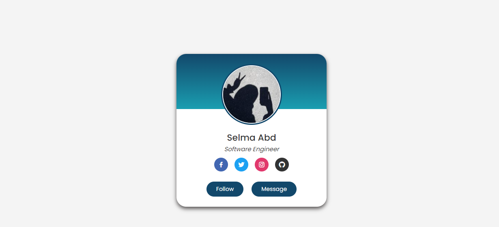

# ProfileCard-HTML-CSS
This project demonstrates a simple profile card design created using HTML and CSS. It includes a profile image, name, job title, social media links, and buttons.

## Table of contents

- [Preview](#preview)
  - [Features](#features)
  - [Installation](#installation)
  - [Usage](#usage)

  ## preview
 
 - Live Site URL: (https://selmaabdelhakk.github.io/ProfileCard-HTML-CSS/)
 ## Features
-Responsive design for various screen sizes.
-Stylish profile card layout with profile image, name, job title, social media links, and buttons.
-Hover effects for buttons.
-Utilizes the "Poppins" font family from Google Fonts for a modern look.
 ## Installation
 1.Clone the repository to your local machine using the following command:
```
git clone https://github.com/yourusername/profile-card-html-css.git
```
2.Navigate to the project directory:
```
cd profile-card-html-css
```
3.Open the index.html file in your preferred web browser to view the profile card.

 ## Usage
-Customize the content by replacing the profile image, name, job title, and social media links in the HTML file (index.html).
-Modify the styles in the CSS file (style.css) to match your design preferences.
-Add more social media links or additional buttons as needed.


